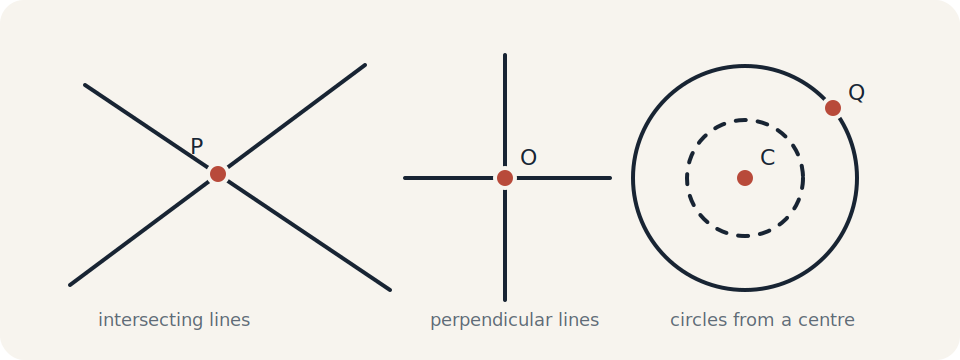

## Before coordinates {#before-coordinates}

A Euclidean space is a line, a plane, or a higher-dimensional space equipped with rules for constructing points, straight lines, circles, perpendiculars, intersections, and lengths.

!!! note "Before coordinates"
    We can already construct geometric objects. Coordinates add an origin, orientation, and numerical scale so that these constructions can be described by numbers.
