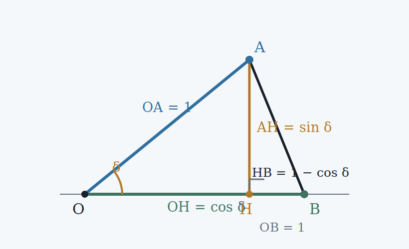
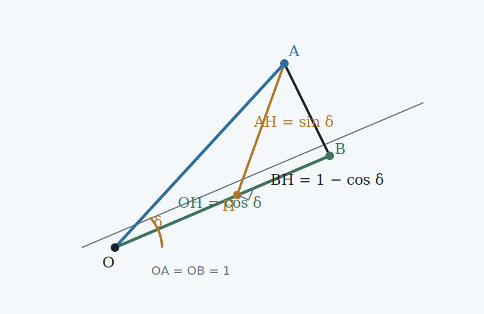

## The cosine of a difference of angles {#cosine-difference}

The coordinate construction already gives us orthogonal projection. We now use it to derive the formula for the cosine of a difference of angles without assuming a dot-product formula.

Choose two unit segments $OA$ and $OB$ with common initial point $O$. Let their directed angles from the positive horizontal axis be $\alpha$ and $eta$. Their endpoints therefore have coordinates

$$
A=(\cos\alpha,\sin\alpha),
\qquad
B=(\cos\beta,\sin\beta).
$$

<figure class="figure-panel">
  

    

      Two unit directions
      The angle between them is $\alpha-\beta$.
    

  

  

    
  

  <figcaption class="figure-caption">The endpoints of unit radii have coordinates $(\cos\theta,\sin\theta)$. The relative angle between the two directions is $\alpha-\beta$.</figcaption>
</figure>

### The same projection described geometrically

Project the unit segment $OA$ orthogonally onto the direction of $OB$. The angle between these two unit directions is $\alpha-\beta$. By the elementary definition of cosine, the signed length of the projection is therefore

$$
\lambda=\cos(\alpha-\beta).
$$

Here the projection is signed: it is positive in the direction of $OB$ and negative in the opposite direction.

### The same projection described by coordinates

Write the unit direction of $OB$ as

$$
e_\beta=(\cos\beta,\sin\beta).
$$

A unit direction perpendicular to it is obtained by a quarter-turn:

$$
n_\beta=(-\sin\beta,\cos\beta).
$$

The segment $OA$ can be decomposed into a component parallel to $e_\beta$ and a component parallel to $n_\beta$:

$$
OA=\lambda e_\beta+\mu n_\beta.
$$

<figure class="figure-panel">
  

    

      Parallel and perpendicular components
      The coefficient $\lambda$ is the signed projection onto $e_\beta$.
    

  

  

    
  

  <figcaption class="figure-caption">The decomposition uses only two perpendicular unit directions. The coefficient of $e_\beta$ is exactly the projection length we want to compute.</figcaption>
</figure>

Since $OA=(\cos\alpha,\sin\alpha)$, equality of coordinates gives

$$
\begin{cases}
\cos\alpha=\lambda\cos\beta-\mu\sin\beta,\\[2mm]
\sin\alpha=\lambda\sin\beta+\mu\cos\beta.
\end{cases}
$$

Multiply the first equation by $\cos\beta$ and the second by $\sin\beta$:

$$
\begin{aligned}
\cos\alpha\cos\beta
  &=\lambda\cos^2\beta-\mu\sin\beta\cos\beta,\\
\sin\alpha\sin\beta
  &=\lambda\sin^2\beta+\mu\sin\beta\cos\beta.
\end{aligned}
$$

Adding the equations removes the perpendicular component:

$$
\cos\alpha\cos\beta+\sin\alpha\sin\beta
=\lambda(\cos^2\beta+\sin^2\beta).
$$

Because $\cos^2\beta+\sin^2\beta=1$, we obtain

$$
\lambda=\cos\alpha\cos\beta+\sin\alpha\sin\beta.
$$

But the geometric description of the same projection gave $\lambda=\cos(\alpha-\beta)$. Hence

!!! theorem "Cosine of a difference"
    $$
    \boxed{\cos(\alpha-\beta)
    =\cos\alpha\cos\beta+\sin\alpha\sin\beta.}
    $$

!!! interpretation "Why the formula appears"
    The identity is not an algebraic coincidence. Both sides measure the same signed projection of one unit direction onto another: the left-hand side uses the angle between the directions, while the right-hand side computes that projection from their coordinates.
